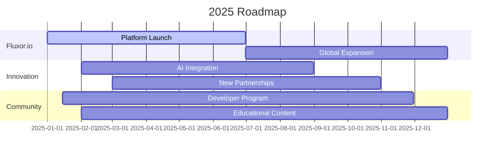

# 👋 Hi there, I'm Kanishak Chaurasia

<div align="center">
  
</div>

<div align="center">
  
  
  
</div>

## 🚀 About Me

```javascript
const kanishak = {
    currentRole: "Founder & CEO at Fluxor.io",
    previousRole: "X-Polycrypt HQ",
    code: ["JavaScript", "TypeScript", "Solidity", "Go", "Rust", "Python"],
    technologies: {
        blockchain: ["Ethereum", "Polygon", "Solana", "Hyperledger"],
        frontend: ["React", "Next.js", "Vue.js", "Tailwind CSS"],
        backend: ["Node.js", "Express", "FastAPI", "GraphQL"],
        cloud: ["AWS", "Azure", "Docker", "Kubernetes"],
        ai: ["TensorFlow", "PyTorch", "OpenAI", "LangChain"]
    },
    architecture: ["Microservices", "Event-Driven", "Serverless", "DeFi"],
    currentFocus: "Building AI-powered Web3 infrastructure at Fluxor.io",
    funFact: "Mentored 200+ blockchain projects that won hackathons worldwide"
};
```

<div align="center">

### 🏢 Professional Journey

</div>

<table align="center">
<tr>
<td align="center" width="50%">

**🔥 Fluxor.io**  
*Founder & CEO* | 2025 - Present
- Building next-gen Web3 & AI infrastructure
- Leading global collaboration initiatives
- Driving industry adoption at scale

</td>
<td align="center" width="50%">

**⚡ X-Polycrypt HQ**  
*Founder & CEO* | 2024 - 2025
- Integrated AI with blockchain systems
- Secured international partnerships
- Foundation for Fluxor.io ecosystem

</td>
</tr>
</table>

## 🛠️ Tech Arsenal

<div align="center">

### Languages & Frameworks
<p>
  
</p>

### Blockchain & Web3
<p>
  
  
  
  
</p>

### Cloud & DevOps
<p>
  
</p>

### Tools & Platforms
<p>
  
</p>

</div>

## 🏆 Featured Projects

<div align="center">

<table>
<tr>
<td width="50%">

### 🏗️ [Hackingly](https://hackingly.in)
**Hackathon & Bootcamp Platform**


- 🎯 Empowered **10,000+** students globally
- 🚀 Hosted **500+** hackathons & bootcamps  
- 💡 Built from scratch with modern tech stack

</td>
<td width="50%">

### ⚡ LazyChain
**AI-Powered Layer 0 Blockchain**


- 🤖 Cross-chain interoperability powered by AI
- 📈 Redefined blockchain accessibility
- 🌍 Industry-wide impact across sectors

</td>
</tr>
<tr>
<td width="50%">

### 🤝 Codeate
**Collaborative Development Platform**


- 💻 Idea sharing & co-creation platform
- 🔄 Boosted developer productivity
- 🌐 Bridges Web2 and Web3 ecosystems

</td>
<td width="50%">

### 🧪 Fluxor.io Labs
**AI-Web3 R&D Hub** *(Ongoing)*


- 🔬 Next-gen AI-integrated infrastructure
- 🌟 Cutting-edge Web3 solutions
- 🎯 Real-world adoption focus

</td>
</tr>
</table>

</div>

## 📊 GitHub Analytics

<div align="center">


</div>

<div align="center">

</div>

## 📈 Contribution Graph

<div align="center">

</div>

## 🏅 GitHub Trophies

<div align="center">

</div>

## 🎯 Current Goals for 2025

<div align="center">



</div>

- 🚀 **Scale Fluxor.io** to serve 1M+ developers worldwide
- 🤖 **Launch AI-powered blockchain tools** for enterprise adoption
- 🌍 **Establish global partnerships** with Fortune 500 companies
- 📚 **Mentor 1000+ projects** in blockchain and AI
- 🎓 **Publish research papers** on Web3 and AI integration

## 🌟 Community Impact

<div align="center">
<table>
<tr>
<td align="center">

</td>
<td align="center">

</td>
<td align="center">

</td>
</tr>
</table>
</div>

## 📝 Latest Blog Posts

<!-- BLOG-POST-LIST:START -->
- 🔥 [The Future of AI-Powered Blockchain Infrastructure](https://example.com)
- ⚡ [Building Scalable DApps: Lessons from 200+ Projects](https://example.com)
- 🚀 [Web3 Leadership: Navigating the Decentralized Future](https://example.com)
- 💡 [Cross-Chain Interoperability: The Next Frontier](https://example.com)
<!-- BLOG-POST-LIST:END -->

## 🤝 Let's Connect & Collaborate

<div align="center">

### 💌 Ready to build the future together?

<p>
<a href="mailto:kanishakchaurasia2@gmail.com">
  
</a>
<a href="https://www.linkedin.com/in/dappdost">
  
</a>
<a href="https://twitter.com/dappdost">
  
</a>
<a href="https://hackingly.in">
  
</a>
</p>

### 🚀 Open for:
- 💼 **Strategic Partnerships** in Web3 & AI
- 🤝 **Collaboration** on innovative blockchain projects  
- 🎤 **Speaking Engagements** at tech conferences
- 💡 **Mentorship** for aspiring blockchain developers
- 🌟 **Investment Opportunities** in decentralized technologies

</div>

---

<div align="center">


**⭐ Star my repositories if you find them helpful!**

</div>
